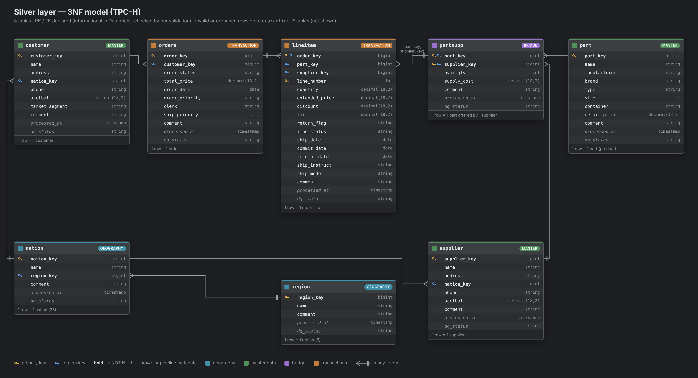
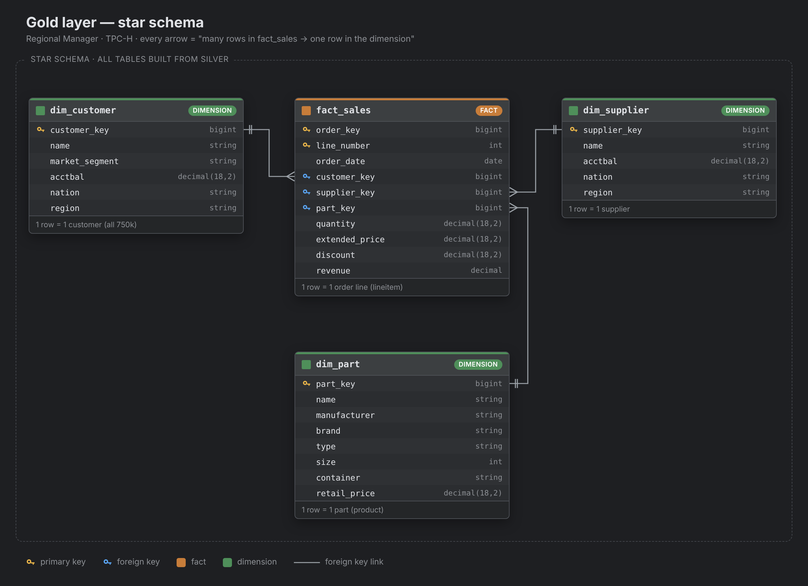

# TPC-H Lakehouse — Regional Manager

Group Assignment 1 · Big Data Analytics Workflows with Databricks · UCU 2026

We move the **TPC-H** data (a wholesale supplier) into a **Lakehouse** on Databricks.
We build three layers — **bronze**, **silver** and **gold** — check that the data is correct,
and answer business questions for a **Regional Manager**: how sales are spread across regions and nations.

📊 **Presentation:** [Canva](https://www.canva.com/design/DAHXQsoufjw/c822KrOBeJzgmWYdbnNv3g/edit)

---

## Team

| Member | Responsibilities |
|---|---|
| Oleksandra Shergina | Setup, Bronze layer, Monitoring, Presentation |
| Viktoriia Lushpak | Silver layer |
| Maksym Hobela | Gold layer |
| Volodymyr Yarishevskyi | Validation, Analysis |

---

## Repository structure

| Folder | File | What is inside |
|---|---|---|
| `/` | `README.md` | This file |
| `/` | `data_migration_lakehouse.ipynb` | **All the code**: setup → bronze → silver → gold → validation → analysis → monitoring |
| `/` | `pyproject.toml`, `uv.lock` | Project settings and library versions for **uv** |
| `/` | `.gitignore` | Files that git does not save |
| `docs/` | `silver_er_diagram.png` | ER diagram of the silver tables |
| `docs/` | `gold_star_schema.png` | Diagram of the gold star schema |

---

## How to run

### What you need
- A **Databricks** workspace (the free **Databricks Free Edition** is enough).
- The sample data `samples.tpch` — it is already included in every Databricks workspace. You do not need to download anything.

### Steps
1. **Get the notebook.** Download this repo (green button **Code → Download ZIP**) and unzip it.
2. **Import it into Databricks.** Go to **Workspace → ⋮ → Import → File** and choose `data_migration_lakehouse.ipynb` (it is in the root of the repo).
   *(Or use **Import → URL** with the "Raw" link of the notebook on GitHub.)*
3. **Connect compute.** At the top of the notebook, choose **Serverless** (or any cluster).
4. **Run it.** Click **Run all**. The notebook runs from top to bottom:
   setup → bronze → silver → gold → validation → analysis → monitoring.
   The first run takes a few minutes, because `lineitem` has about **30 million rows**.
5. **Check the result.** In the *Validation* section you should see ✅ for every check and the message **"All checks passed"**.

### Catalog name
The notebook works in the default catalog of the workspace (`workspace` on Databricks Free Edition).
All tables are called by `schema.table`, for example `silver.customer` or `gold.fact_sales`.
If your workspace uses another default catalog, run `USE CATALOG <your_catalog>` before **Run all**,
and type the same name in the `catalog` field at the top of the notebook.

### Optional: local Python environment with uv
The main code runs **in Databricks**, because it needs Spark and `samples.tpch`.
uv is only used to describe the Python project and its libraries
(`pandas` and `matplotlib` for the charts, `jupyterlab` to open the notebook on your computer).

```bash
# 1. install uv (one time)
pip install uv            # or: curl -LsSf https://astral.sh/uv/install.sh | sh

# 2. install all libraries from uv.lock
uv sync

# 3. (optional) open the notebook locally to read it
uv run jupyter lab data_migration_lakehouse.ipynb
```

> You can **read** the notebook locally, but to **run** it you need Databricks.

---

## Architecture

```
samples.tpch  ──►  BRONZE  ──►  SILVER  ──►  GOLD  ──►  analysis + monitoring
(source)         (copy as is)  (3NF, clean,  (star schema)
                               quarantine)
```

| Layer | Schema | What we do |
|---|---|---|
| Bronze | `bronze` | Copy all 8 TPC-H tables **with no changes**. We only add `_ingested_at` and `_source`. |
| Silver | `silver` | Clean model in **3NF** with data quality rules. Bad rows go to `quarantine`. |
| Gold | `gold` | **Star schema** made for the Regional Manager questions. |

### Bronze
- Reads 8 tables from `samples.tpch` and saves them to `bronze.*`.
- Adds metadata: `_ingested_at` (time of loading) and `_source` (where the data came from).
- Checks that every bronze table has the same number of rows as the source.

### Silver
Main task: **enforce data quality.** Our processing pipeline for every table:
1. Rename columns to clear names (for example `r_regionkey` → `region_key`).
2. Cast types (keys → `BIGINT`, money → `DECIMAL(18,2)`, dates → `DATE`).
3. Remove duplicates by primary key.
4. Check data quality rules (for example: keys are not NULL, prices are not negative).
5. Check referential integrity (every foreign key must exist in the parent table).
6. Put invalid or orphaned rows into a **quarantine** table (`quarantine.quarantine_<table>`) with the time.
7. Add metadata: `processed_at` and `dq_status`.
8. Write to silver with `MERGE` (SCD Type 1) and `OPTIMIZE ... ZORDER BY` for the big tables.

Tables have `PRIMARY KEY` and `FOREIGN KEY` constraints and `NOT NULL` columns.
In Databricks, `NOT NULL` is **enforced**, but PK/FK are **informational only** —
that is why we check keys ourselves (see *Validation*).

To test the pipeline, the notebook adds 3 bad rows to `bronze.orders`
(a negative price, a NULL key and an order with a customer that does not exist).
All 3 rows end up in `quarantine.quarantine_orders`, and `silver.orders` stays clean.
So the books always balance: **rows in bronze = rows in silver + rows in quarantine**
(this is why `bronze.orders` has 3 rows more than `silver.orders`).



### Gold
We use a **star schema** (Kimball): one fact table in the middle and small dimension tables around it.

| Table | Type | One row = (grain) |
|---|---|---|
| `fact_sales` | fact | one order line (lineitem) — only keys and numbers |
| `dim_customer` | dimension | one customer, with nation and region inside (**all** customers) |
| `dim_supplier` | dimension | one supplier, with nation and region inside |
| `dim_part` | dimension | one part (product) |

**Why a star schema:**
- Every question needs only **one join** from the fact to a dimension (in silver it is up to four).
- Geography is used in **two roles**: the customer's region and the supplier's region (needed for Q3).
- A One Big Table would lose customers with no orders — but Q2 asks about **all** customers in India.
- A snowflake schema would keep the long chain of joins from silver, so it does not help analytics.
- TPC-H has no history of changes, so the dimensions are **SCD Type 1** (we overwrite them).



### Definitions (used everywhere)
- **Revenue** = `extended_price * (1 - discount)` — after the discount, without tax.
- **Sales region** = the **customer's** region.
- **Cross-region sale** = the customer's region is not the same as the supplier's region.

---

## Validation

Validation uses all layers to prove that the data can be trusted.
Every check is a SQL query that **counts bad rows**. The result must be **0**.
If any check fails, the notebook **stops** with an error, so the analysis never runs on broken data.

### Rules from the assignment

| Rule | How we check it |
|---|---|
| Every customer and supplier has a valid nation, and every nation has a valid region | Count customers, suppliers and nations without a matching parent row; also check there are exactly 5 regions and 25 nations |
| Revenue per region adds up correctly and is not counted twice | Compare total revenue in bronze, silver, gold and the **sum of the 5 regions** — all four numbers must be equal |

### All checks
- customers without a valid nation
- suppliers without a valid nation
- nations without a valid region
- number of regions is not 5 / number of nations is not 25
- `gold.fact_sales` has a different row count than `silver.lineitem`
- duplicate order lines in `gold.fact_sales`
- sales without a customer / supplier / part in the dimensions
- `gold.dim_customer` has a different row count than `silver.customer`
- **revenue reconciliation:** bronze = silver = gold = sum of 5 regions (difference ≤ $0.01)

We also check every silver table on its own (primary key, foreign keys, data quality, row count, revenue).

### Demo: what happens with bad data?
1. We try to insert a region **without a name** → Databricks blocks it (`NOT NULL` is enforced).
2. A nation with a region that does not exist would be accepted by Databricks (FK is not enforced) —
   only our validation query finds it.

---

## Business questions and answers

All answers are calculated from the **gold** layer only.

**Q1. What are the top 5 products by revenue in Asia?**

| part_key | brand | revenue |
|---|---|---|
| 807849 | Brand#54 | 1,019,365.63 |
| 691917 | Brand#11 | 1,013,138.06 |
| 373918 | Brand#34 | 1,006,606.67 |
| 356801 | Brand#21 | 1,006,420.58 |
| 18762 | Brand#54 | 1,005,901.24 |

The difference between the products is very small (about 1%). Brand#54 is in the list two times.

**Q2. How many customers are in India, and what is the average account balance?**

**30,234** customers, average account balance **4,499.90**.
2,766 of them have a negative balance.

**Q3. Which region has the highest total revenue, and what share of sales is between a customer and a supplier in different regions?**

**EUROPE** has the highest revenue — **20.09%** of the total. All 5 regions are very close (about 20% each).
**79.99%** of revenue comes from cross-region sales.
This is what we expect if suppliers are chosen at random: with 5 regions, the chance that the supplier
is in another region is 4 / 5 = 80%. TPC-H is synthetic data, so this is not a real logistics pattern.

**Q4. Are there products sold in only one or two regions? What might that mean?**

**No.** Every product is sold in all regions. The data is synthetic and spread evenly, so this is not realistic.
In real life, products sold in only 1–2 regions could mean a local or niche product,
a chance to grow in other regions, or a risk if that one region goes down.

---

## Monitoring

We track how revenue by region changes over time:
1. **Monthly revenue by region** — a line chart.
2. **Region rank by quarter** — which region is #1, #2, … in every quarter.
3. **Quarter-over-quarter change** — revenue change in % and rank change for every region.
   This table shows when a region loses positions or its revenue drops.

The last month and the last quarter in the data are **not complete**, so we do not use them in the comparisons.

---

## Challenges

- **Foreign keys are not enforced in Databricks.** We had to write our own checks for every relationship.
- **Working on one notebook as a team.** Different column names (for example `cust_key` vs `customer_key`)
  broke code between layers, so we agreed on one naming style.
- **Choosing the gold model.** We compared One Big Table, star and snowflake and chose the star schema.
- **Big data.** `lineitem` has about 30 million rows, so some steps take a few minutes.
- **Incomplete last period.** The last month of data is not complete, so we removed it from monitoring.
- **Synthetic data.** TPC-H is spread very evenly, so some answers (Q3, Q4) look "too perfect".
